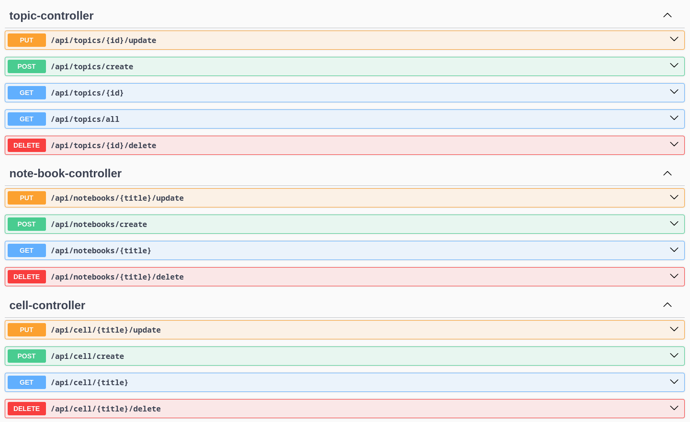

# Проект: Лекториум на графах

## Описание проекта

**Лекториум на графах** — это платформа для публикации лекций и учебных материалов в виде графовой структуры. Она предоставляет удобное рабочее окружение для пользователей, желающих организовывать материалы в виде узлов и связей, обеспечивая наглядность и удобство восприятия.

## Запуск проекта

### 1. Поднятие базы данных
Запустите сервис базы данных PostgreSQL с помощью Docker:

```bash
docker compose up postgres
```

### 2. Сборка и запуск Backend
1. Перейдите в каталог `/Lectorium`:
   ```bash
   cd Lectorium
   ```
2. Соберите проект с помощью Maven:
   ```bash
   ./mvnw clean package
   ```
3. Запустите Backend-сервис:
   ```bash
   docker compose up app
   ```

### 3. Запуск Frontend
1. Перейдите в каталог фронтенда:
   ```bash
   cd front
   ```
2. Установите зависимости:
   ```bash
   npm install
   ```
3. Запустите приложение:
   ```bash
   npm run dev
   ```

## Структура проекта

### База данных

**СУБД**: PostgreSQL

#### Контейнеризация

База данных запускается в Docker-контейнере, описанном в `docker-compose.yaml`:

```yaml
services:
  postgres:
    image: postgres:16
    container_name: lectrium_test
    restart: always
    environment:
      POSTGRES_DB: test
      POSTGRES_USER: test
      POSTGRES_PASSWORD: test
    ports:
      - "5455:5432"
    volumes:
      - postgres_data:/var/lib/postgresql/data
```

- **Имя контейнера**: `lectrium_test`
- **База данных**: `test`
- **Порт внутри контейнера**: `5432`
- **Порт на хосте**: `5455`

### Backend

**Технологии:**
- Spring Boot
- Spring Data JPA
- REST API

#### REST-сервис для создания лекций
Backend предоставляет REST API для работы с лекциями, позволяя создавать, редактировать и удалять узлы лекционной структуры.



### Frontend

**Фреймворк:** Vue.js

**Основные библиотеки:**
- Vue Router (для маршрутизации)
- Vuex (для управления состоянием)
- Axios (для работы с API)
- D3.js (для визуализации графов)

Frontend предоставляет удобный интерфейс для взаимодействия с пользователем, позволяя создавать лекционные материалы, связывать их между собой и просматривать в виде графа.

---
Этот проект ориентирован на преподавателей, студентов и исследователей, которым важно визуально представлять учебные материалы. Благодаря использованию современных технологий, платформа гибка, удобна и расширяема.

